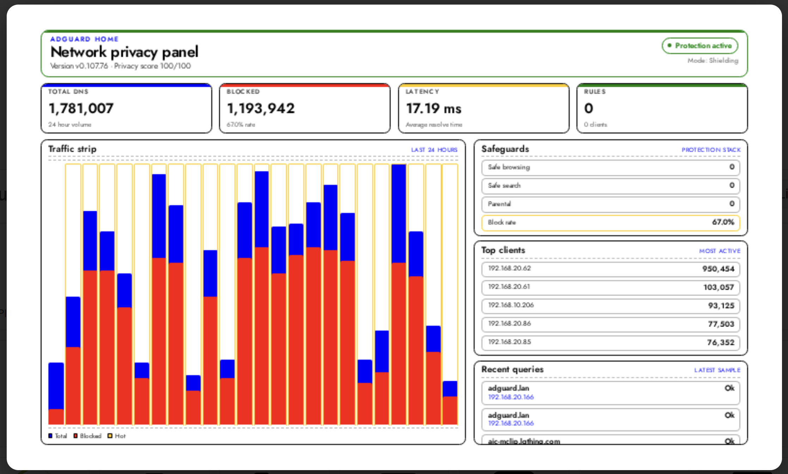
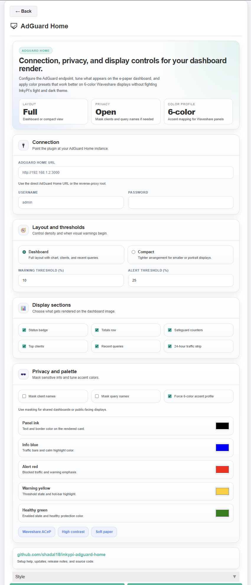

# InkyPi AdGuard Home

An InkyPi plugin that shows AdGuard Home statistics with a clean layout and configurable display settings.

_AdGuard Home_ is a plugin for [InkyPi](https://github.com/fatihak/InkyPi) that shows live DNS and blocking statistics from your AdGuard Home instance on your InkyPi device.

## Install

Use the InkyPi plugin installer with the plugin ID and this repository URL.

```bash
inkypi install adguard_home https://github.com/shadal18/inkypi-adguard-home
```

## Update

To update the plugin on your InkyPi device:

1. SSH into your InkyPi host.
2. Change into the plugin directory:
   ```bash
   cd ~/InkyPi/src/plugins/adguard_home
   ```
3. Run this update command:
   ```bash
   git pull origin main && \
   sudo systemctl restart inkypi.service
   ```

## Requirements

- A reachable AdGuard Home web URL
- Optional AdGuard Home username and password if authentication is enabled
- Network access from the InkyPi device to the AdGuard Home server

## Features

This plugin is an extension for the InkyPi e-paper display frame and includes the following features.

- Shows total DNS queries
- Shows blocked query totals and block percentage
- Displays AdGuard Home protection status
- Displays version information
- Shows filtering rule count when available
- Displays top clients when available
- Shows recent query activity when available
- Includes a 24-hour traffic chart
- Supports configurable layout sections
- Supports privacy-focused display options
- Can be styled for 6-color Waveshare displays

## Settings

The plugin settings page lets you customize:

- AdGuard Home URL
- Username
- Password
- Layout mode
- Warning threshold
- Alert threshold
- Visible dashboard sections
- Privacy masking options
- Color accents for the rendered display

## AdGuard Home Setup

This plugin requires access to your AdGuard Home web interface.

### Configure AdGuard Home access

1. Open your AdGuard Home web interface.
2. Confirm the server is reachable from your InkyPi device.
3. Copy the base URL for your AdGuard Home instance.
4. If authentication is enabled, use your AdGuard Home username and password in the plugin settings.

### Add the settings in InkyPi

1. Open the InkyPi front page.
2. Open the AdGuard Home plugin settings.
3. Enter your AdGuard Home URL.
4. Add your username and password if required.
5. Save the plugin settings.
6. Refresh or rerender the display if needed.

## API Endpoints Used

This plugin currently reads data from AdGuard Home API endpoints such as:

- `/status`
- `/stats`
- `/filtering/status`

Depending on the plugin version and configuration, additional optional endpoints may be used for client and query information.

## Repository

GitHub repository:

[https://github.com/shadal18/inkypi-adguard-home](https://github.com/shadal18/inkypi-adguard-home)

## Screenshots

- Main plugin display showing AdGuard Home statistics
- Plugin settings screen

<p align="center">
  
  
</p>
